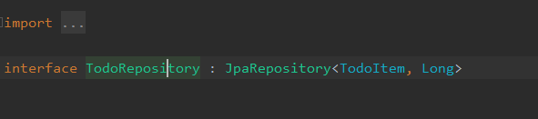
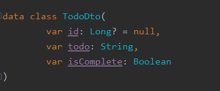
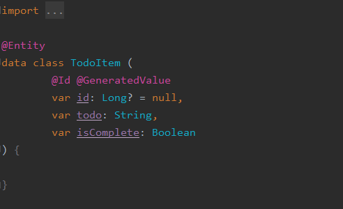

# TodoList (CRUD TEST PROJECT)

Kotlin & Spring boot 연습을 위한 CRUD 기반 TodoList 프로젝트

## Architecture

프로젝트 구조에 대한 간단한 설명

***

### DAO

Inmemory DB 를 이용한, Todo DB 에 접근하는 Layer 로, 비즈니스 작업이 구축된 Service Layer 로부터 Dto 를 받아,
Entity 로 변경 후, DB 에 접근

리턴해줄 때는 다시 DTO 포맷으로 리턴해준다.

***

### DTO

Contoller -> Service, Service -> DAO, DAO -> Service 등 Layer 간 데이터 교환이 이루어질 때, 사용되는 객체로,

본 프로젝트에서는 primary key 로 Todo 의 id 를 가지고 있고, 할 일, 완료여부로 이루어져 있다.

***

### Entity

실제 DB 스키마와 매칭되는 객체로, Service Layer 로부터 받은 DTO Format 을 Mapper 를 통해 Entity 로 변경 후, DB 와 접근한다.

***

### Controller

Client 로부터 요청을 받아 플로우를 처리하는 곳으로, 비즈니스 로직을 Service Layer 에게 넘겨준다.

실제 Controller 는 Bean 에 할당된 Service Layer 의 메소드만 호출하는 역할을 하고, 모든 비즈니스 로직 처리는 Service Layer 에서 일어난다.

***

### 결론

지금과 같이 작은 프로젝트에선 다음과 같은 구조를 잡고 코딩하는 것이 뚜렷한 이점을 보이긴 어려우나,
큰 프로젝트에서는 테스트하기 용이하고, 코드 수정 등에 있어서 5가지 SOLID 원칙을 지키면서 깔끔하게 구현하기에 용이하다.
